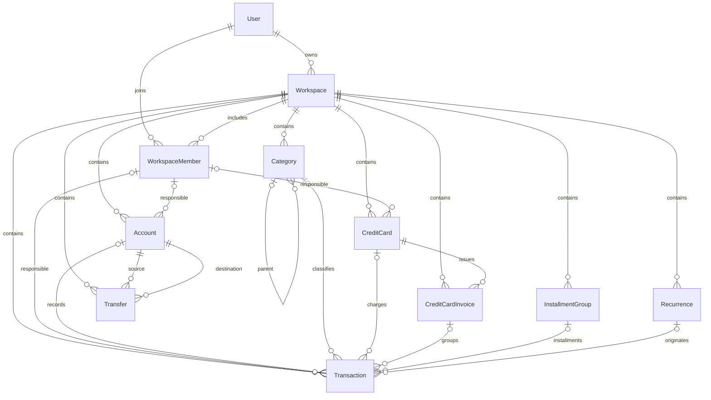

# Database Schema v1

O tenant é `Workspace`. Cada entidade financeira e cada associação de membro contém `workspaceId` obrigatório. `User` é global e pode participar de vários workspaces por `WorkspaceMember`. UUIDs identificam registros; não concedem acesso. A futura API deverá autorizar cada operação e filtrar leituras pelo workspace.

## Entidades e relacionamentos

| Model             | Responsabilidade                                                                                                                                     |
| ----------------- | ---------------------------------------------------------------------------------------------------------------------------------------------------- |
| User              | Identidade de domínio, email único, nome e avatar opcional. Sem senha ou provedor de autenticação.                                                   |
| Workspace         | Tenant PERSONAL, FAMILY ou BUSINESS, com proprietário referenciado por `ownerId → User.id`. BUSINESS fica disponível para evolução futura.           |
| WorkspaceMember   | Associação usuário/workspace com papel. Um usuário só tem uma associação por workspace.                                                              |
| Account           | Conta corrente, poupança, dinheiro, investimento ou outra conta. Saldo inicial, moeda BRL por padrão, responsável opcional e indicador de atividade. |
| Category          | Classificação de receita/despesa com pai opcional no mesmo workspace.                                                                                |
| Transaction       | Lançamento central: previsto, efetivo, situação, datas e vínculos opcionais. `createdBy → User.id` registra autoria.                                 |
| InstallmentGroup  | Documento pai de parcelamento, com total contratado e quantidade de parcelas.                                                                        |
| Recurrence        | Modelo de recorrência mensal/anual, intervalo e cursor da próxima geração.                                                                           |
| CreditCard        | Cartão, limite, dias padrão de fechamento/vencimento e conta de pagamento opcional.                                                                  |
| CreditCardInvoice | Fatura de cartão identificada pelo mês de referência. Não possui total persistido.                                                                   |
| Transfer          | Movimento entre duas contas do mesmo workspace, separado de receitas e despesas.                                                                     |

`createdBy` referencia `User` em Transaction, InstallmentGroup, Recurrence e Transfer. A autoria permanece preservada mesmo que a associação do usuário ao workspace seja removida; `createdBy` deve pertencer ao workspace do registro no momento da criação, com associação `(workspaceId, userId = createdBy)` em WorkspaceMember e permissão de escrita validadas pelo service. A FK para User, sozinha, não garante essa associação. `ownerMemberId` referencia o identificador de WorkspaceMember, não User.



Diagrama simplificado: os vínculos de autoria e algumas relações opcionais dos documentos pais foram omitidos para legibilidade. O schema é a referência completa.

## Enums

| Enum                | Valores                                    |
| ------------------- | ------------------------------------------ |
| WorkspaceType       | PERSONAL, FAMILY, BUSINESS                 |
| WorkspaceRole       | OWNER, ADMIN, MEMBER, VIEWER               |
| AccountType         | CHECKING, SAVINGS, CASH, INVESTMENT, OTHER |
| CategoryType        | INCOME, EXPENSE                            |
| TransactionType     | INCOME, EXPENSE                            |
| TransactionStatus   | PENDING, PAID, OVERDUE, CANCELLED          |
| RecurrenceFrequency | MONTHLY, YEARLY                            |
| InvoiceStatus       | OPEN, CLOSED, PAID, OVERDUE                |

Recurrence reutiliza TransactionType. TRANSFER não pertence a esse enum. Novos lançamentos começam PENDING, novas faturas OPEN, registros com `isActive` começam ativos e o intervalo da recorrência começa em 1. O tipo de workspace e os papéis devem ser informados explicitamente.

## Dinheiro, identificadores e datas

Todos os valores monetários usam `Decimal @db.Decimal(19, 2)` (PostgreSQL NUMERIC): 17 dígitos inteiros e dois decimais, sem Float. Saldo inicial aceita valores negativos e começa em zero. CHECKs SQL exigem valores estritamente positivos em Transaction.expectedAmount e Transaction.amount quando presentes, Recurrence.expectedAmount, InstallmentGroup.totalAmount e Transfer.amount. Zero, negativos e NaN são rejeitados. Account.initialBalance e CreditCard.creditLimit não representam movimentações e não recebem esses CHECKs; o saldo inicial continua aceitando zero e negativos. O sentido da movimentação é dado por INCOME/EXPENSE ou origem/destino, sem usar montante negativo. A política futura de estornos deverá respeitar essa convenção. A aplicação deverá calcular com Decimal e serializar dinheiro como string, evitando conversão para Number. PostgreSQL arredonda entradas com mais de duas casas; o service deverá validar precisão antes da gravação.

Moeda usa código de até três caracteres, BRL por padrão em Account. A v1 trabalha em BRL; não há conversão cambial nem moeda independente para cartões e lançamentos. Antes de aceitar outras moedas, o service deverá definir e validar a moeda de todos os documentos envolvidos e impedir transferências incompatíveis.

IDs são UUIDs nativos, gerados no PostgreSQL por `gen_random_uuid()`, também em inserções SQL diretas. Não é necessária uma extensão no PostgreSQL 17 local. Todas as FKs de identificadores usam UUID.

Datas de negócio (`transactionDate`, `competenceDate`, `dueDate`, `purchaseDate`, `startDate`, `endDate`, `nextGenerationDate`, `referenceMonth`, `closingDate`, `transferDate`) usam `@db.Date`: são dias de calendário sem horário. `createdAt`, `updatedAt` e `paidAt` usam `@db.Timestamptz(3)`: representam instantes. O futuro service deverá tratar datas de negócio sem conversões locais que mudem o dia.

`createdAt` tem default no banco. `updatedAt` é atualizado por Prisma (`@updatedAt`), não por trigger PostgreSQL: escritas SQL diretas precisam fornecê-lo/atualizá-lo. Transfer também possui `updatedAt` obrigatório; apenas WorkspaceMember mantém somente `createdAt`. Não há trigger de atualização automática para escritas SQL diretas.

## Competência, previsto e realizado

A visão principal usa vencimento. Compra em 28/09/2026 com vencimento em 10/10/2026 terá `transactionDate=2026-09-28`, `competenceDate=2026-10-01` e `dueDate=2026-10-10`. O primeiro dia do mês de vencimento será calculado pelo service; o banco não calcula competência.

Transaction mantém `expectedAmount` e `amount` separadamente. Cada campo é nullable, mas o service deve obrigatoriamente exigir pelo menos um deles (`expectedAmount IS NOT NULL OR amount IS NOT NULL`); ambos nulos constituem um lançamento inválido. Essa condição entre campos está documentada para o service, sem CHECK nesta revisão. Energia prevista: 150.00/null/PENDING. Valor conhecido: 150.00/173.48/PENDING. Pagamento: 150.00/173.48/PAID com `paidAt`. Não existe outra entidade para previsto ou realizado. O service deve obrigatoriamente exigir `amount` e `paidAt` não nulos quando `Transaction.status = PAID`, inclusive em atualizações. `expectedAmount` sozinho não satisfaz um lançamento pago. Essa condição e as transições de status permanecem no service; o banco garante a positividade dos montantes preenchidos. CreditCardInvoice não tem campo amount: a regra descrita se aplica a Transaction.

## Parcelamentos e recorrências

InstallmentGroup guarda `totalAmount`, `installmentCount` e `purchaseDate`. Não entra como despesa nos relatórios: as Transactions vinculadas representam as parcelas reais. `(installmentGroupId, installmentNumber)` é único quando ambos estão preenchidos; PostgreSQL permite vários valores nulos para lançamentos avulsos. O service deverá exigir o par junto e `1 <= Transaction.installmentNumber <= InstallmentGroup.installmentCount` no grupo vinculado, inclusive ao alterar a quantidade de parcelas, além de geração idempotente. O banco exige `InstallmentGroup.installmentCount > 0`; o limite do número da parcela depende de outra tabela e fica no service. A soma das parcelas deverá preservar o total (100/3 = 33.33 + 33.33 + 33.34), sem contar o grupo novamente.

Recurrence define valor previsto, tipo, frequência, intervalo, dia de vencimento e datas de início/fim/próxima geração. A futura geração manterá uma janela móvel de 12 meses. O cursor não executa geração automaticamente. O banco exige `interval > 0` e `dueDay BETWEEN 1 AND 31`. Datas ordenadas, ajuste para meses curtos e idempotência concorrente deverão ser tratados pelo service. Não se adicionou uma unicidade por recorrência e data sem definir antes a identidade de cada ocorrência.

## Cartões, faturas e transferências

`closingDay` é o dia padrão de virada. Com closingDay=25 e dueDay=10, compras em 24/09 deverão ir para outubro (10/10); compras em 26/09 para novembro (10/11). O caso no próprio dia de virada, meses curtos e exceções serão definidos no service. As datas efetivas permanecem armazenadas na fatura.

`referenceMonth` é um DATE convencionalmente normalizado para o primeiro dia do mês. `(creditCardId, referenceMonth)` é único. A normalização é obrigatória no service: o banco distingue 01/10 de 02/10. O total da fatura deverá vir das Transactions associadas, com política explícita para previstos/cancelados, nunca de um total armazenado em CreditCardInvoice.

Transfer registra origem, destino, valor e data; ambas as contas devem pertencer ao workspace da transferência. Não gera INCOME/EXPENSE e não há TransactionType.TRANSFER. CHECKs exigem origem diferente de destino e valor estritamente positivo. O service também deve validar essas condições e garantir moedas compatíveis.

## Integridade garantida no banco

- CHECKs SQL: CreditCard.closingDay, CreditCard.dueDay e Recurrence.dueDay entre 1 e 31, inclusive; Recurrence.interval e InstallmentGroup.installmentCount maiores que zero.
- CHECKs SQL: cinco campos monetários de movimentação positivos quando presentes, com rejeição de NaN, e Transfer.sourceAccountId diferente de Transfer.destinationAccountId.
- Transfer.updatedAt obrigatório, com atualização gerenciada pelo Prisma.
- PK UUID em todos os models; workspace obrigatório em todas as entidades financeiras.
- Email único (comparação padrão do PostgreSQL, sensível a maiúsculas). Normalização de email fica no service.
- Associação única `(workspaceId, userId)` e fatura única `(creditCardId, referenceMonth)`.
- Parcela única `(installmentGroupId, installmentNumber)` para pares preenchidos.
- Relações financeiras usam FKs compostas `(workspaceId, relatedId) → (workspaceId, id)`, incluindo pai de categoria, responsáveis, conta de pagamento do cartão, fatura, recorrência, grupo e as duas contas de transferência. Elas impedem referências cruzadas entre tenants mesmo por SQL direto.
- As chaves únicas `(workspaceId, id)` nos alvos existem para suportar essas FKs; embora `id` já seja globalmente único, PostgreSQL exige uma chave correspondente às colunas referenciadas.
- Todas as relações usam `onDelete: Restrict` e `onUpdate: Restrict`: não se apagam históricos em cascata nem se propagam mudanças de tenant/ID. Relações opcionais não usam SetNull, pois a FK também contém o workspace obrigatório. Desvinculação explícita e desativação devem ser coordenadas pelo service.

## Invariantes obrigatórias no service

Além das regras financeiras acima, as FKs não substituem estas verificações:

1. Autenticar futuramente o usuário, validar associação e papel no workspace em cada leitura/escrita e derivar `createdBy` da identidade autorizada. Nunca confiar no workspace ou autor enviado pelo cliente. Não há RLS ou autenticação implementada.
2. Criar/alterar proprietário e associação OWNER de forma atômica, garantindo que `Workspace.ownerId` corresponda ao proprietário membro; impedir remoção do último proprietário e definir políticas para ADMIN/MEMBER/VIEWER. O banco não sincroniza ownerId e role.
3. Tratar workspaceId como imutável. Mesmo com FKs compostas, um registro sem dependentes poderia ser movido junto com suas referências por SQL; essa operação não deve ser exposta pela API.
4. Verificar atividade e permissões do responsável e das entidades usadas. FKs garantem existência e tenant, não autorização, papel ou isActive.
5. Garantir obrigatoriamente que, quando houver `Transaction.invoiceId`, `Transaction.creditCardId` esteja preenchido e seja igual a `CreditCardInvoice.creditCardId` da fatura referenciada. A regra também deve ser preservada ao editar o cartão de uma fatura com lançamentos. Ambos são do mesmo tenant pelo banco, mas podem apontar para cartões distintos dentro dele. Definir também a compatibilidade entre conta, cartão, grupo e recorrência, sem bloquear no schema combinações cujo significado ainda será definido.
6. Garantir tipo compatível das categorias e impedir ciclos/autorreferência na hierarquia. O banco garante apenas que pai e filho pertençam ao mesmo tenant.
7. Validar e normalizar meses, dias 1–31, datas, quatro dígitos do cartão, código de moeda, precisão/sinal dos valores, estado de pagamento e vínculo/número das parcelas. Os CHECKs descritos acima cobrem limites dos dias, intervalos, quantidade de parcelas, positividade monetária e contas distintas. Pertencimento de createdBy, coerência cartão/fatura, número da parcela, presença de expectedAmount ou amount e exigências de PAID permanecem validações obrigatórias no service.
8. Implementar geração, fechamento e pagamento futuramente em transações atômicas, com controle de concorrência e idempotência. Soma de parcelas, saldo e total de faturas não são impostos por FKs.

## Índices

Transaction possui índices `(workspaceId, competenceDate)` para a consulta mensal, `(workspaceId, dueDate)` para vencimentos sem filtro de status e `(workspaceId, status, dueDate)` para situações/prazos. Possui índices compostos por workspace com accountId, categoryId, creditCardId, invoiceId, recurrenceId, installmentGroupId e ownerMemberId, para filtros e relacionamentos.

Os demais índices cobrem FKs compostas, usuário/autor/proprietário, transferências por data e recorrências ativas por próxima geração dentro do workspace. Faturas têm índice por workspace/status/vencimento. As consultas futuras do gerador entre todos os tenants poderão exigir um índice diferente após medir o plano de execução.

Não há índices isolados em workspaceId porque os índices compostos já começam com essa coluna. As chaves únicas já geram índices, sem duplicação idêntica. Os índices de vencimento com e sem status atendem filtros diferentes; o de status não resolve eficientemente todos os filtros de data sem status.

## Migration e validação

Migration inicial: `20260928180702_database_schema_v1`. Cria 11 tabelas, 8 enums e 11 CHECKs SQL, sem seed ou alterações em telas/endpoints. Esta migration de desenvolvimento foi atualizada no lugar a pedido do projeto, após confirmar que as 11 tabelas locais estavam vazias, e foi reaplicada com `prisma migrate reset --force` após autorização explícita para recriar o schema local. O reset foi concluído, os 11 CHECKs foram conferidos no catálogo e os testes passaram com ROLLBACK. Esse comando apaga os dados do schema configurado; não remove container ou volume. Em ambientes com dados reais, criar uma nova migration em vez de editar migrations aplicadas. Os CHECKs são mantidos manualmente no SQL porque o schema Prisma 7 não os representa. Comentários em schema.prisma apontam essa responsabilidade; não substituir a migration por um diff gerado só do schema nem usar db push para instalar o banco. `migrate diff` valida as estruturas representáveis, mas `db:test` e o catálogo PostgreSQL verificam os CHECKs. O Prisma Client/adapter não é instalado nem gerado: ainda não há consumidor de persistência na API.

```bash
pnpm db:validate
pnpm db:format
# Para futuras alterações locais (revisar SQL antes de aplicar):
pnpm exec prisma migrate dev --name descricao --create-only
# Aplicar migrations existentes:
pnpm db:migrate
pnpm exec prisma migrate status
pnpm db:test
pnpm lint
pnpm build
pnpm test
pnpm format:check
```

`db:test` usa o psql do container PostgreSQL local, sem dependência adicional. Cria fixtures temporárias numa transação e termina com ROLLBACK, inclusive desfazendo sua função auxiliar. Verifica referências entre tenants (inclusive UPDATE), unicidades, referências opcionais, separação de valores previstos/efetivos, datas, precisão decimal, enum sem TRANSFER, proteção contra exclusões em cascata, fronteiras 1/31 e 0/32 para dias, contagens positivas, montantes zero/negativos/NaN, transferências para a mesma conta e Transfer.updatedAt obrigatório. Requer o Compose iniciado e migrations aplicadas; não é executado por `pnpm test`, que continua independente de banco.

A estratégia de FKs segue o [modo foreignKeys do Prisma](https://docs.prisma.io/docs/orm/prisma-schema/data-model/relations/relation-mode); migrations existentes são aplicadas com [Prisma Migrate](https://docs.prisma.io/docs/orm/reference/prisma-cli-reference).
